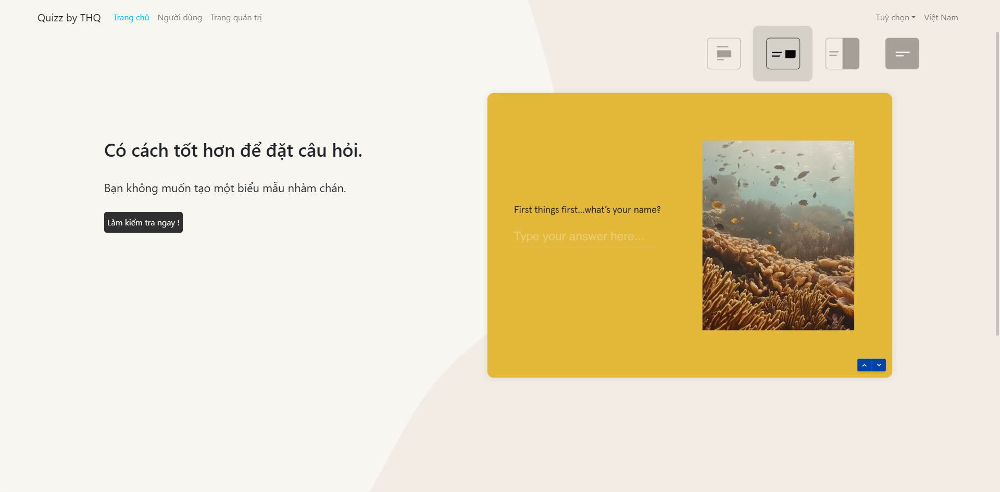
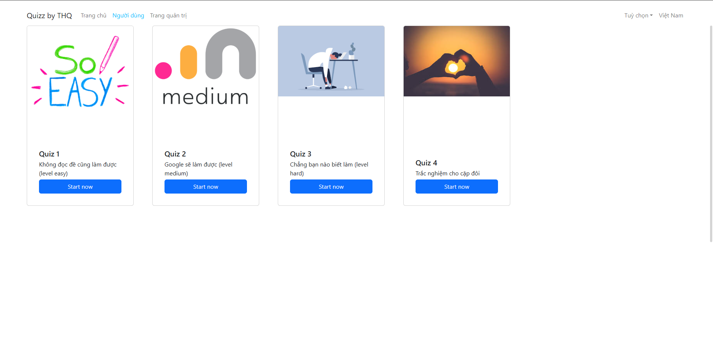
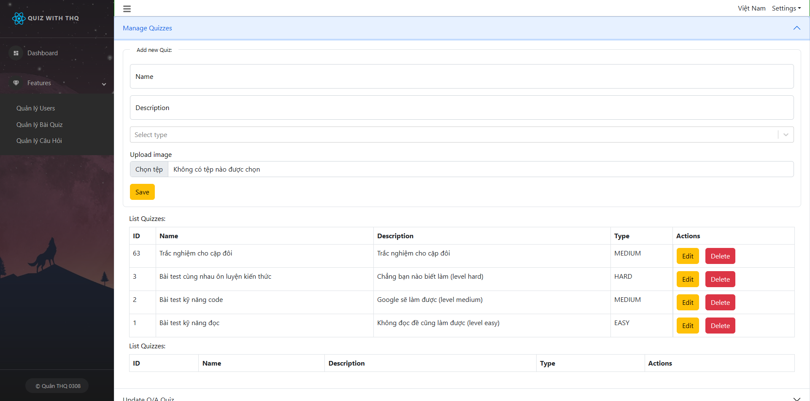
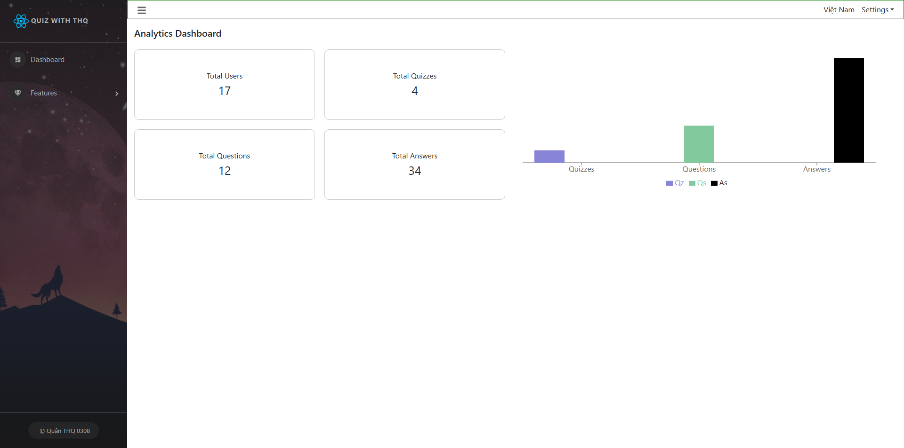

# WEBSITE QUIZ ONLINE

### Các công nghệ sử dụng:

-   Front-end
    -   Core: React
    -   Routing: React Router
    -   State: Redux
    -   UI: Bootstrap
    -   API: Axios
    -   Style: Sass
    -   i18n: React i18next

### Môi trường cài đặt và công nghệ sử dụng:

Website được xây dựng trên nền tảng ReactJS và NodeJS trong môi trường phần mềm Visual Studio Code. Các công nghệ sử dụng bao gồm:

-   Frontend:

-   ReactJS: Sử dụng cả React Hooks và React Class Components để xây dựng giao diện người dùng. ReactJS giúp xây dựng các giao diện động và dễ dàng quản lý trạng thái.

-   Material-UI: Thư viện giao diện người dùng giúp xây dựng các thành phần đẹp mắt và dễ sử dụng với thiết kế hiện đại.

-   HTML, SCSS, Javascript: SCSS được sử dụng để viết mã CSS một cách có cấu trúc và dễ bảo trì, trong khi JavaScript được dùng cho các logic xử lý trên client-side.

### Về tính năng của hệ thống:

-   Đăng ký và quản lý tài khoản: Người dùng có thể đăng ký, cập nhật thông tin, đổi mật khẩu và khôi phục mật khẩu qua email. Quản trị viên có thể quản lý tài khoản (thêm, sửa, xóa, khóa/mở khóa).

-   Quản lý bài kiểm tra: Người dùng có thể xem danh sách các bài kiểm tra, chọn bài kiểm tra theo chủ đề hoặc độ khó, và thực hiện bài kiểm tra trực tuyến.

-   Kết quả và đánh giá: Sau khi hoàn thành bài kiểm tra, hệ thống sẽ hiển thị kết quả chi tiết, bao gồm điểm số, câu trả lời đúng/sai, và giải thích cho từng câu hỏi.

-   Quản lý câu hỏi và bài kiểm tra: Quản trị viên có thể thêm, sửa, xóa câu hỏi và bài kiểm tra. Hệ thống hỗ trợ phân loại câu hỏi theo chủ đề và độ khó.

-   Phân quyền người dùng: Quản trị viên có toàn quyền quản lý hệ thống, trong khi người dùng thông thường chỉ có thể thực hiện bài kiểm tra và xem kết quả.

### GIAO DIỆN WEBSITE

-   Giao diện trang chủ

-   Giao diện trắc nghiệm

-   Giao diện trang quản lý câu hỏi của quản trị viên

-   Giao diện trang quản lý thông tin của quản trị viên

### Link dự án

Link FE: https://github.com/thquan0308/OnlineQuiz

### Các bước cài đặt:

1. Cài đặt ứng dụng ReactJS: Gõ lệnh
   npm install
   npm start

2. Các phiên bản sử dụng
   Node version v22.11.0
   Npm version 10.9.0
